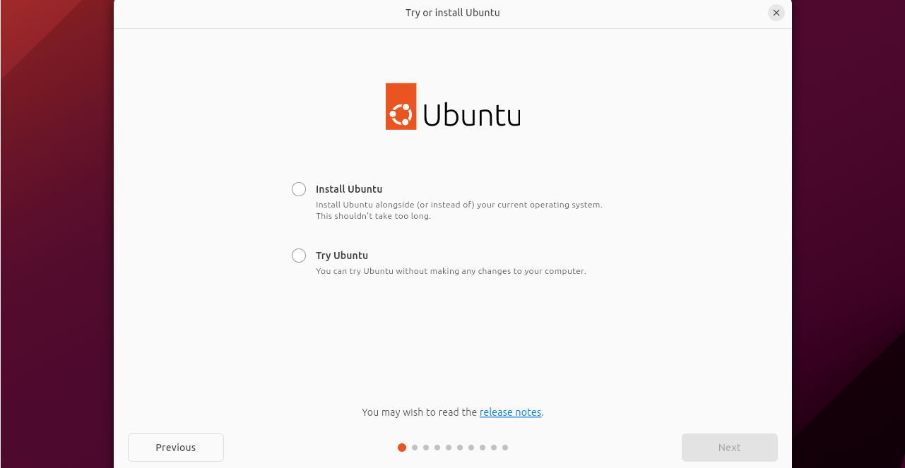
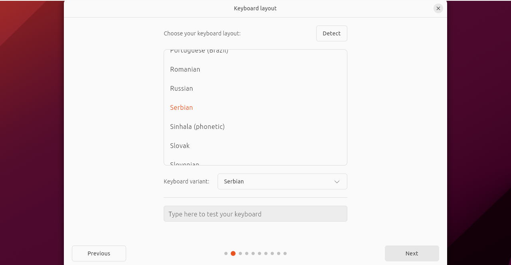
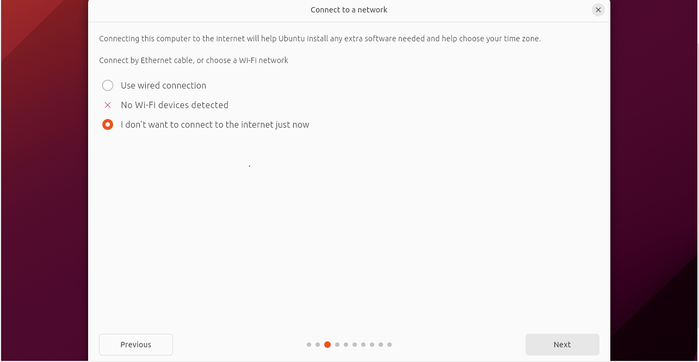
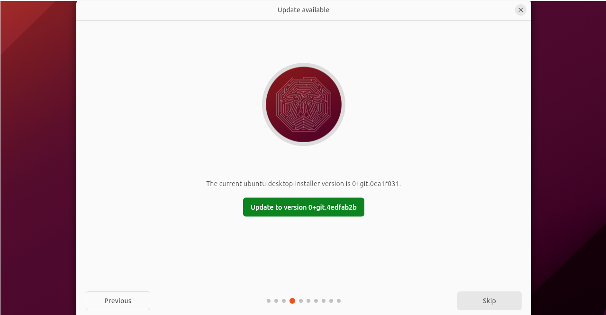
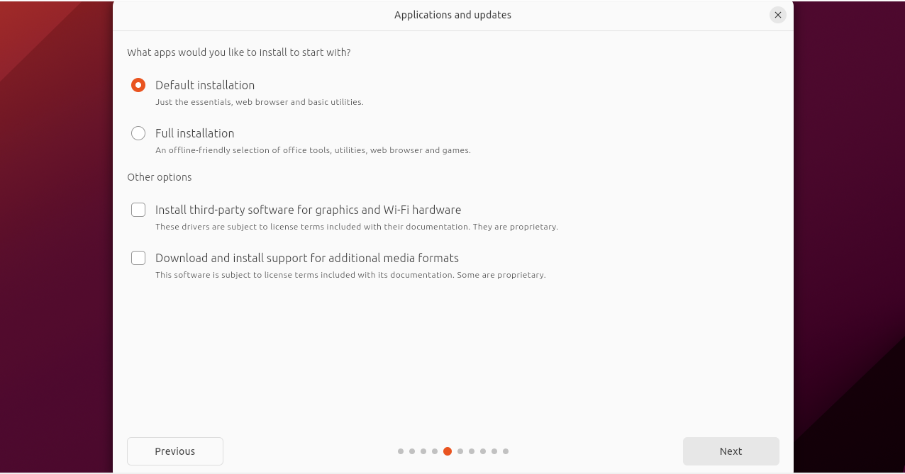
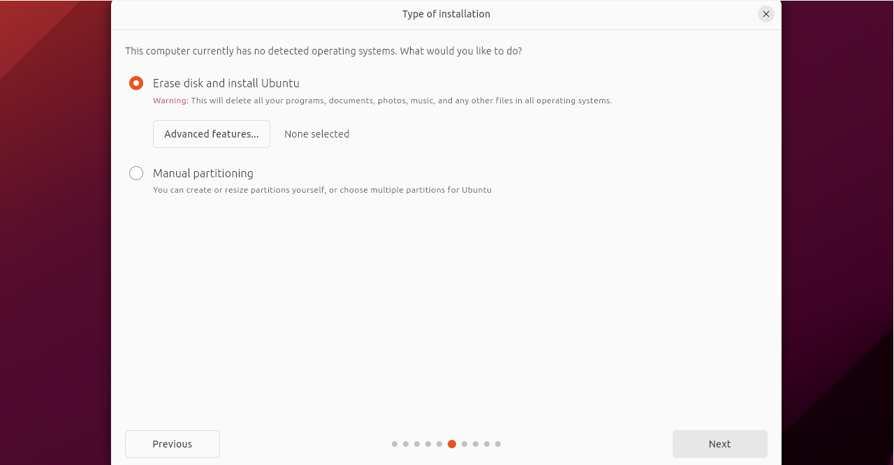
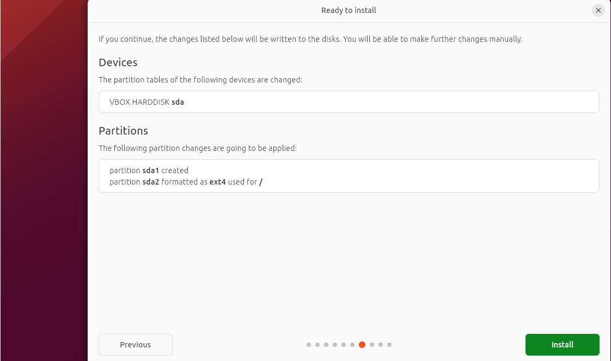
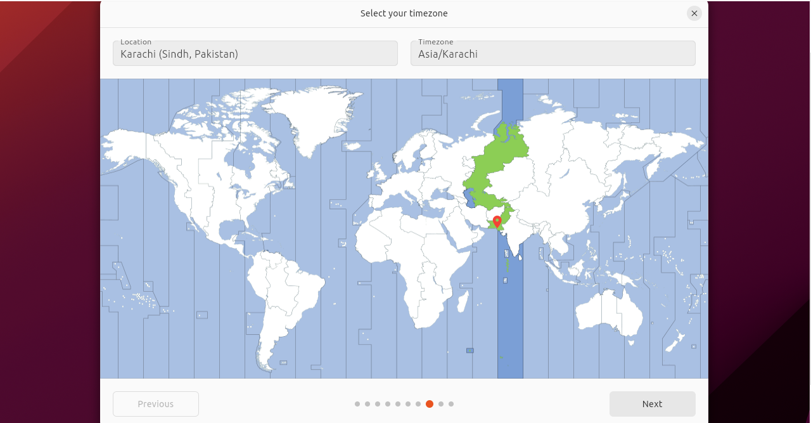
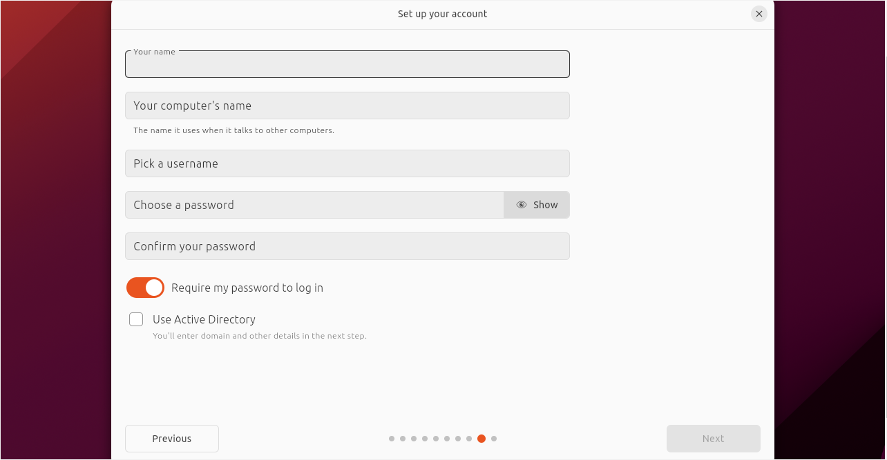

 								**Manual For Installing Ubuntu**

- Set the VMware station for running the ubuntu file.

- After creating a virtual disk for ubuntu run it.

This screen will appear when you run the virtual disk.

Select your Language and click Next.

Select Install Ubuntu and then click next.

Select your keyboard layout and then click next.

Select weather you want to connect to the internet and then click Next.

Update if you want or else click Skip.

Select Default Installation and click Next.

Select Erase Disk and Install Ubuntu and then click Next.

Click Install.

Select your region and click Next

Enter your details i.e you name,computer’s name, username and password and then Click Next.

Select your desired theme and then click Next.

Installation will begin ,wait for it to complete.

After some time setup will be completed and you can run ubuntu through VMWare Station.

