# Scripting

### **Task#1**

- Script for multiplying 2 numbers and displaying the result.

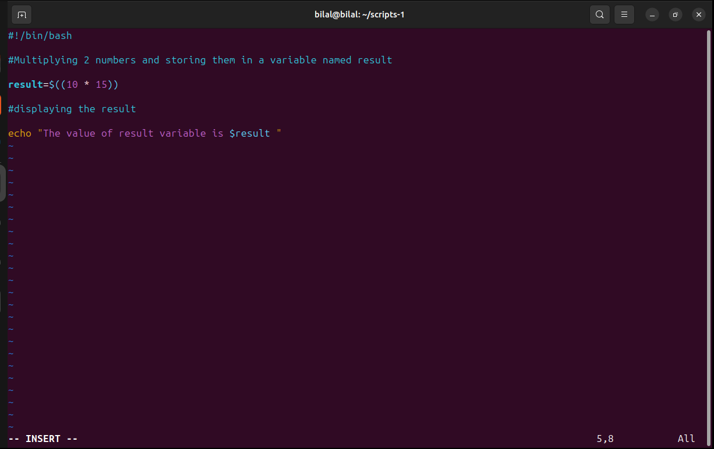

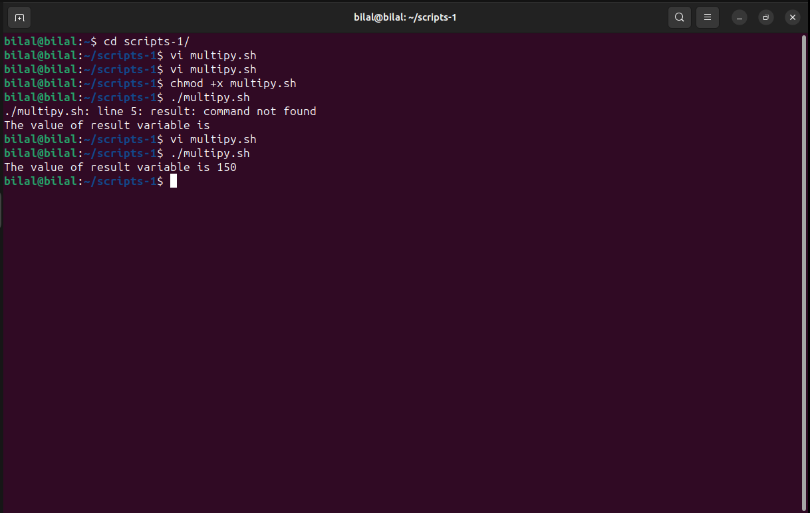

- Script for combining the pieces of information entered by the user and displaying them.

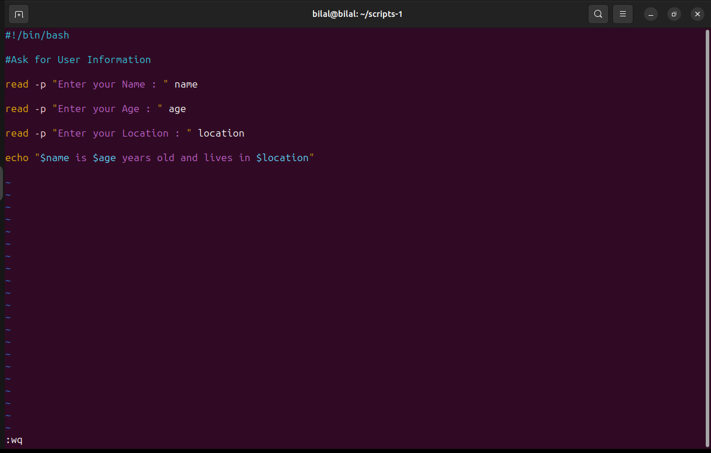

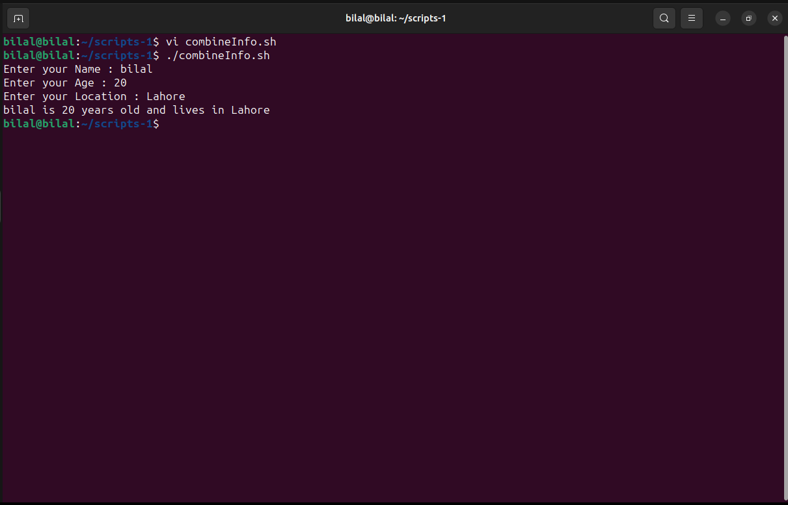

- Script for printing the current working directory.

 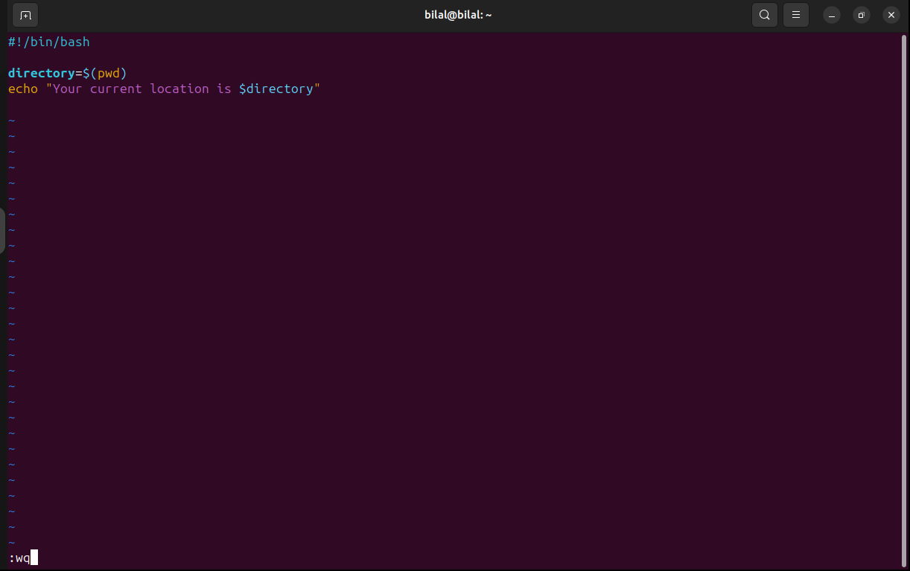

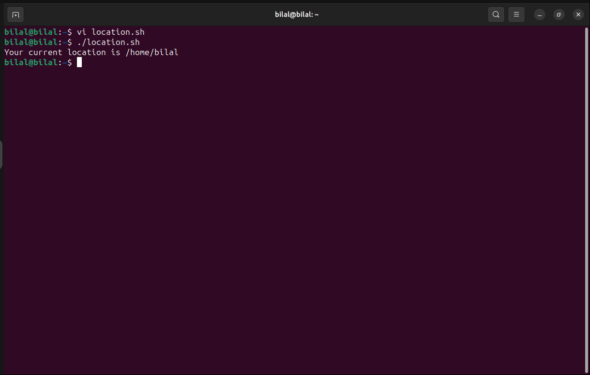

- Script for displaying all files present in a specific directory.

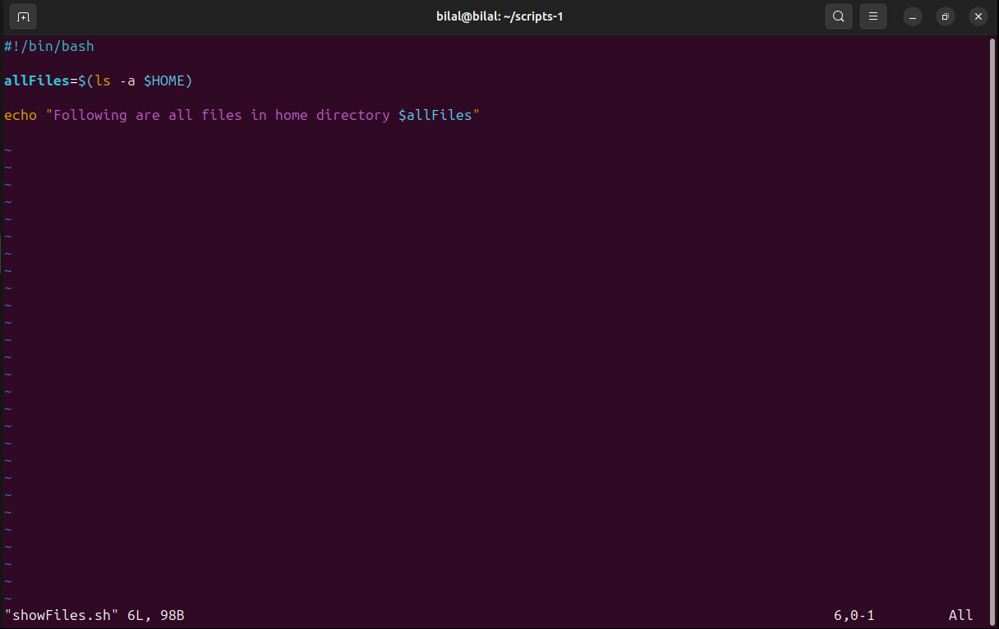

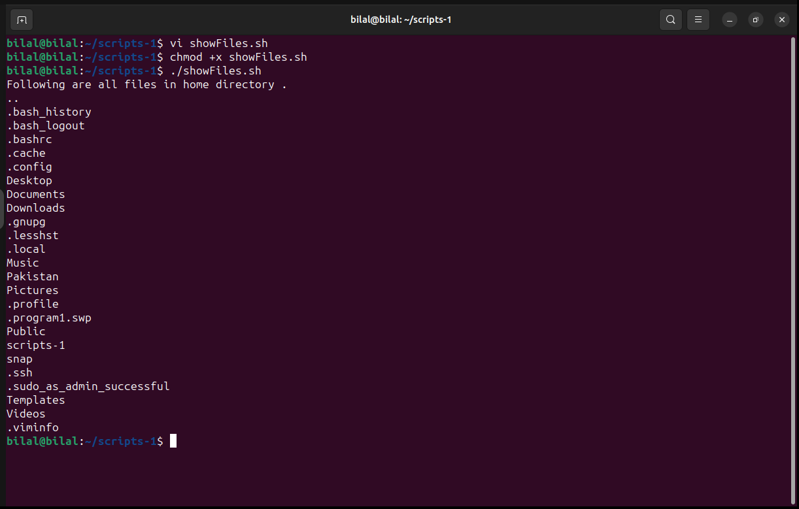

- Script for displaying the current date and time.

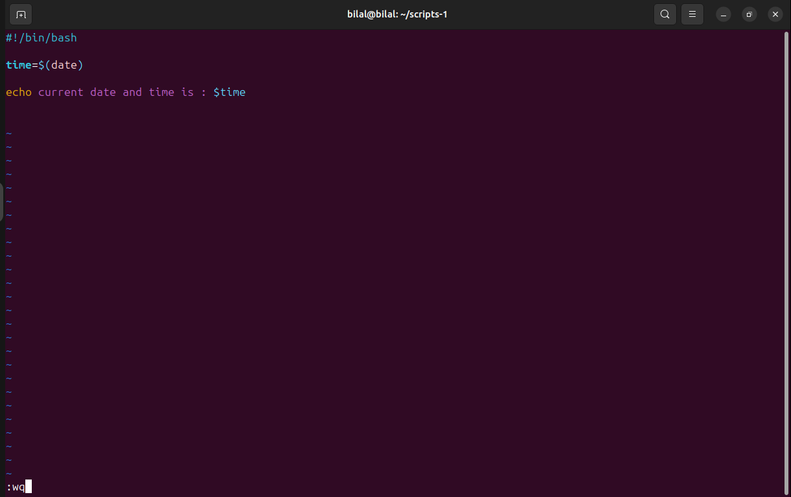

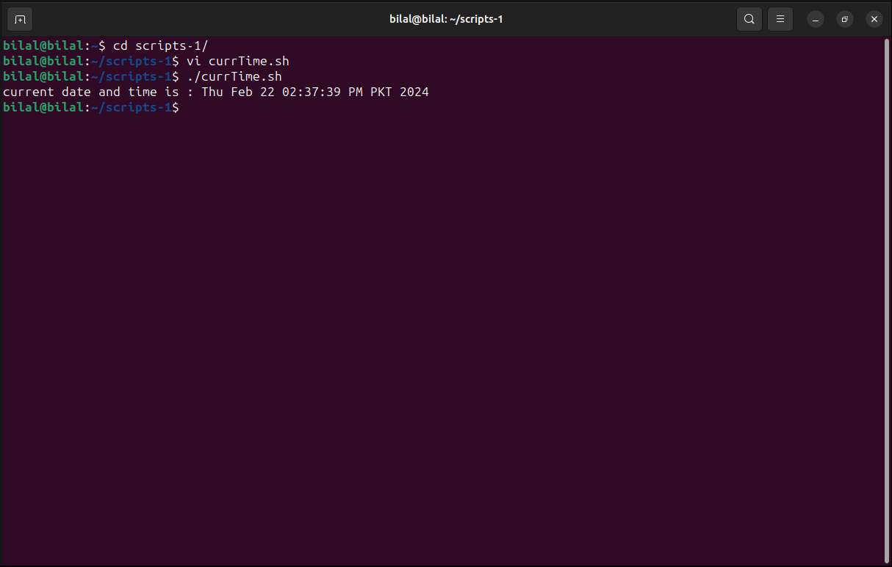

- Script for displaying a specific message.

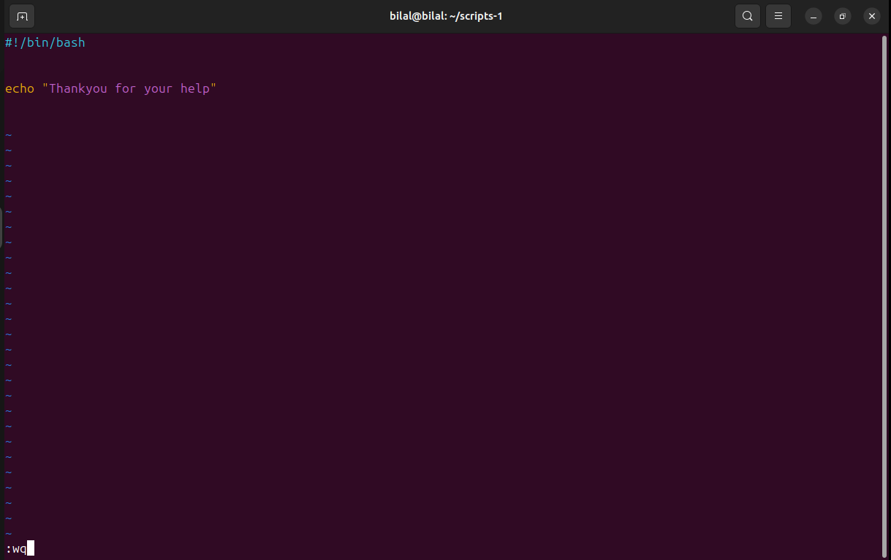

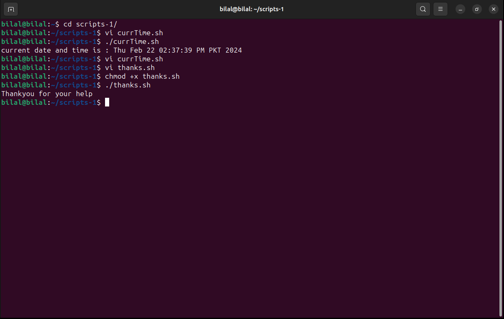

### **Task#2**

- Script for performing the arithmetic operations (i.e. addition , subtraction and multiplication ) on some numbers and displaying there result.

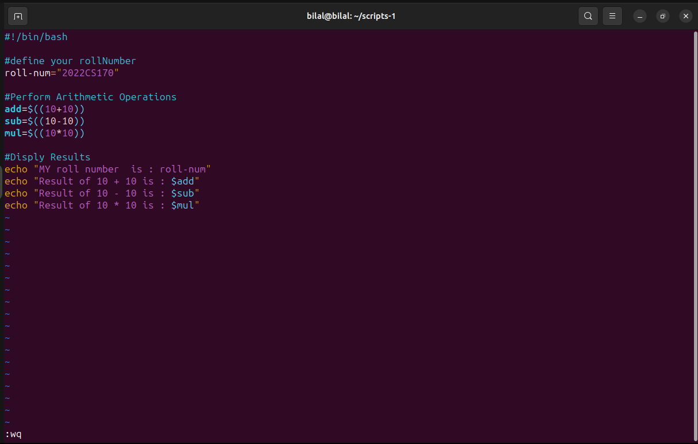

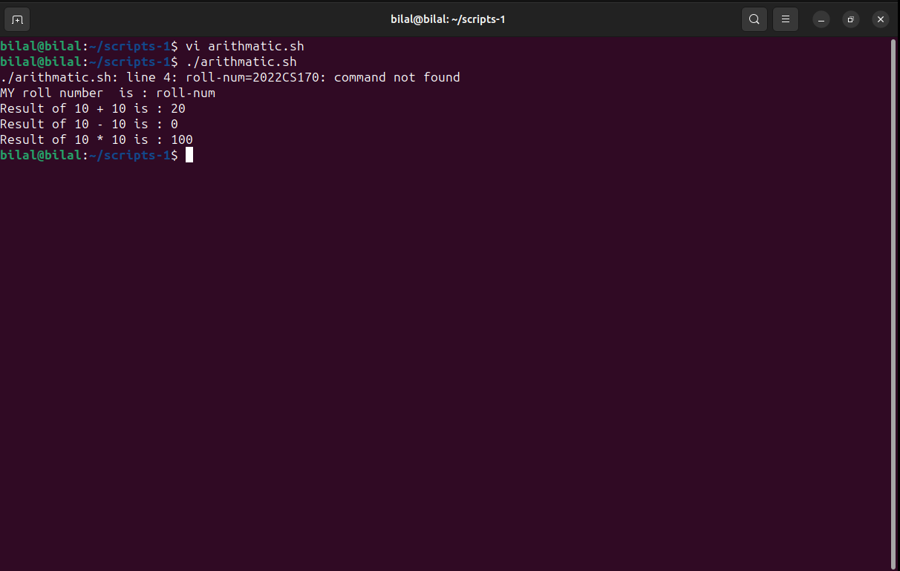

- Script of using all the relational operations on some values and display there results on the screen.

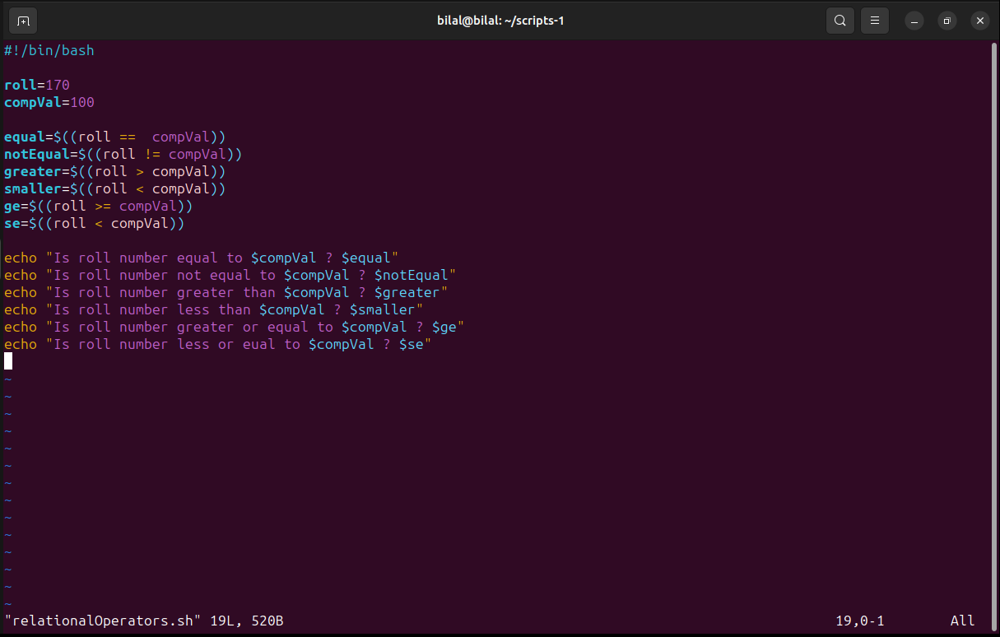

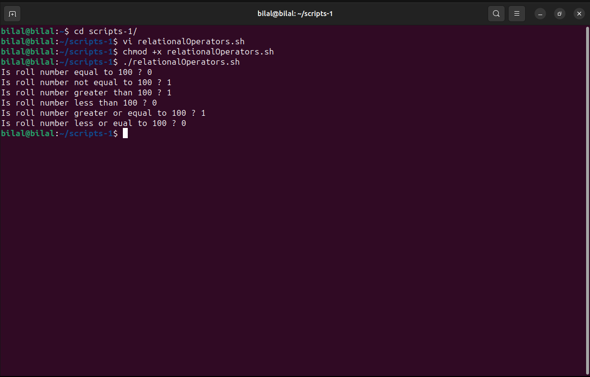
